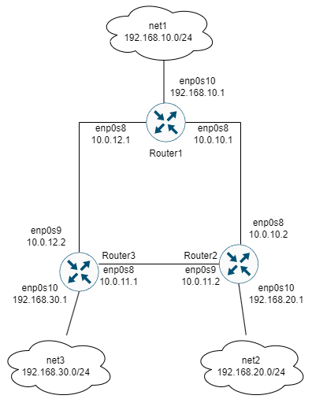

# ospf
Работа с протоколом OSPF
1. Разворачиваем 3 виртуальные машины
2. Так как мы планируем настроить OSPF, все 3 виртуальные машины должны быть соединены между собой (разными VLAN), а также иметь одну (или несколько) доолнительных сетей, к которым, далее OSPF сформирует маршруты. Исходя из данных требований, мы можем нарисовать топологию сети:
3. 
4. Настройка OSPF.
Отключение фаерволла ufw на всех ВМ:
```
sudo systemctl stop ufw
sudo systemctl disable ufw
```
5. Установка FRR:
```
sudo apt update
sudo apt install frr frr-pythontools -y
```
6. Разрешение маршрутизации транзитных пакетов на всех ВМ:
```
sudo sysctl net.ipv4.conf.all.forwarding=1
```
7. Подключение демона osfpd в FRR:
```
nano /etc/frr/daemons
...
cat /etc/frr/daemons
zebra=yes
ospfd=yes
bgpd=no
ospf6d=no
...
```
8. Настройка OSFP с помощью правки конфигурационного файла /etc/frr/frr.conf:
``` 
nano /etc/frr/frr.conf
...
cat /etc/frr/frr.conf
frr version 8.1
frr defaults traditional

hostname router1
log syslog informational
no ipv6 forwarding
service integrated-vtysh-config
!
interface enp0s8
 description r1-r2
 ip address 10.0.10.1/30
 ip ospf mtu-ignore
 !ip ospf cost 1000
 ip ospf hello-interval 10
 ip ospf dead-interval 30
!
interface enp0s9
 description r1-r3
 ip address 10.0.12.1/30
 ip ospf mtu-ignore
 !ip ospf cost 45
 ip ospf hello-interval 10
 ip ospf dead-interval 30
!
interface enp0s10
 description net_router1
 ip address 192.168.10.1/24
 ip ospf mtu-ignore
 !ip ospf cost 45
 ip ospf hello-interval 10
 ip ospf dead interval 30
!
router ospf
 router-id 1.1.1.1
 network 10.0.10.0/30 area 0
 network 10.0.12.0/30 area 0
 network 192.168.10.0/24 area 0
 neighbor 10.0.10.2
 neighbor 10.0.12.2   
!
log file /var/log/frr/frr.log
default-information originate always
``` 
9. Аналогичные действия необходимо произвести на ВМ router2 и router3, изменяя соответствующие параметры ip хостов и сетей, а также router_id.
10. Перезапуск и добавление FRR в автозагрузку:
```
sudo systemctl restart frr
sudo systemctl enable frr
```
11. Проверка корректности запуска OSFP
```
sudo systemctl status frr
● frr.service - FRRouting
     Loaded: loaded (/lib/systemd/system/frr.service; enabled; vendor preset: enabled)
     Active: active (running) since Fri 2024-07-26 10:41:29 UTC; 2h 7min ago
       Docs: https://frrouting.readthedocs.io/en/latest/setup.html
    Process: 4180 ExecStart=/usr/lib/frr/frrinit.sh start (code=exited, status=0/SUCCESS)
   Main PID: 4191 (watchfrr)
     Status: "FRR Operational"
      Tasks: 9 (limit: 498)
     Memory: 12.1M
        CPU: 4.369s
     CGroup: /system.slice/frr.service
             ├─4191 /usr/lib/frr/watchfrr -d -F traditional zebra ospfd staticd
             ├─4207 /usr/lib/frr/zebra -d -F traditional -A 127.0.0.1 -s 90000000
             ├─4212 /usr/lib/frr/ospfd -d -F traditional -A 127.0.0.1
             └─4215 /usr/lib/frr/staticd -d -F traditional -A 127.0.0.1
...
```
12. Просмотр маршрутов на роутерах (вывод router1):
```
root@router1:~# vtysh

Hello, this is FRRouting (version 8.1).
Copyright 1996-2005 Kunihiro Ishiguro, et al.

router1# show ip route ospf
Codes: K - kernel route, C - connected, S - static, R - RIP,
       O - OSPF, I - IS-IS, B - BGP, E - EIGRP, N - NHRP,
       T - Table, v - VNC, V - VNC-Direct, A - Babel, F - PBR,
       f - OpenFabric,
       > - selected route, * - FIB route, q - queued, r - rejected, b - backup
       t - trapped, o - offload failure

O   10.0.10.0/30 [110/100] is directly connected, enp0s8, weight 1, 00:01:21
O>* 10.0.11.0/30 [110/200] via 10.0.10.2, enp0s8, weight 1, 00:00:41
  *                        via 10.0.12.2, enp0s9, weight 1, 00:00:41
O   10.0.12.0/30 [110/100] is directly connected, enp0s9, weight 1, 00:01:21
O   192.168.10.0/24 [110/100] is directly connected, enp0s10, weight 1, 00:01:21
O>* 192.168.20.0/24 [110/200] via 10.0.10.2, enp0s8, weight 1, 00:00:46
O>* 192.168.30.0/24 [110/200] via 10.0.12.2, enp0s9, weight 1, 00:00:41
```
13. Проверка доступности подсетей 192.168.20.0/24 и 192.168.30.0/24:
```
root@router1:~# ping -c 2 192.168.20.1
PING 192.168.20.1 (192.168.20.1) 56(84) bytes of data.
64 bytes from 192.168.20.1: icmp_seq=1 ttl=64 time=0.251 ms
64 bytes from 192.168.20.1: icmp_seq=2 ttl=64 time=0.423 ms

--- 192.168.20.1 ping statistics ---
2 packets transmitted, 2 received, 0% packet loss, time 1016ms
rtt min/avg/max/mdev = 0.251/0.337/0.423/0.086 ms
root@router1:~# ping -c 2 192.168.30.1
PING 192.168.30.1 (192.168.30.1) 56(84) bytes of data.
64 bytes from 192.168.30.1: icmp_seq=1 ttl=64 time=0.287 ms
64 bytes from 192.168.30.1: icmp_seq=2 ttl=64 time=0.415 ms

--- 192.168.30.1 ping statistics ---
2 packets transmitted, 2 received, 0% packet loss, time 1009ms
rtt min/avg/max/mdev = 0.287/0.351/0.415/0.064 ms
```
14. 
